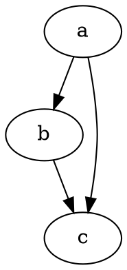

This is my first post on my new fake blog! How exciting!

abcdefg:100:abcdefg
あいうえお:100:あいうえお

I'm sure I'll write a lot more interesting things in the future.

Oh, and here's a great quote from this Wikipedia on
[salted duck eggs](https://en.wikipedia.org/wiki/Salted_duck_egg).

> A salted duck egg is a Chinese preserved food product made by soaking duck
> eggs in brine, or packing each egg in damp, salted charcoal. In Asian
> supermarkets, these eggs are sometimes sold covered in a thick layer of salted
> charcoal paste. The eggs may also be sold with the salted paste removed,
> wrapped in plastic, and vacuum packed. From the salt curing process, the
> salted duck eggs have a briny aroma, a gelatin-like egg white and a
> firm-textured, round yolk that is bright orange-red in color.


```javascript{numberLines:true}{4,6-7}:title=example.js
plugins:[
  {
    resolve: `gatsby-transformer-remark`,
      options: {
        plugins: [
          `gatsby-remark-prismjs`,
        ]
      }
    }
  } 
]
```

```c:title=test.c
int hoge;
hoge++;
```



$a^2 + b^2 = c^2$

$$
a^2 + b^2 = c^2
$$

// In your markdown file

Check it out! I can use oembed links in my markdown.

`oembed: https://twitter.com/raae/status/1045394833001652225`

Its pretty cool :D

`oembed: https://www.instagram.com/p/Bof9WhgBmY2/`

`oembed: https://giphy.com/gifs/cats-transport-13borq7Zo2kulO`